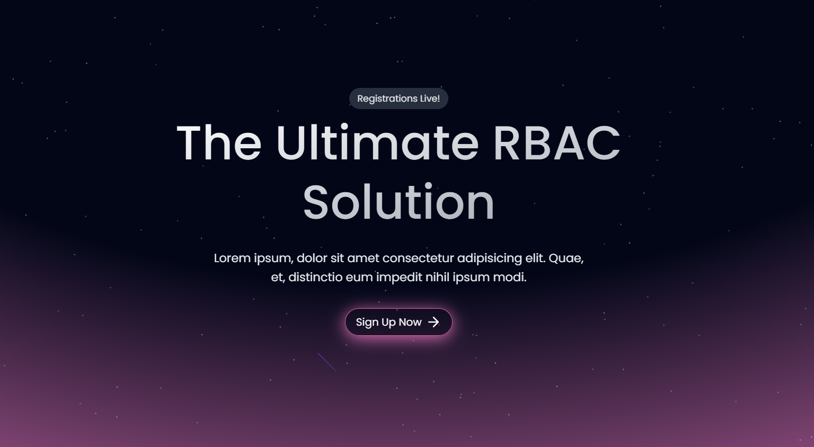
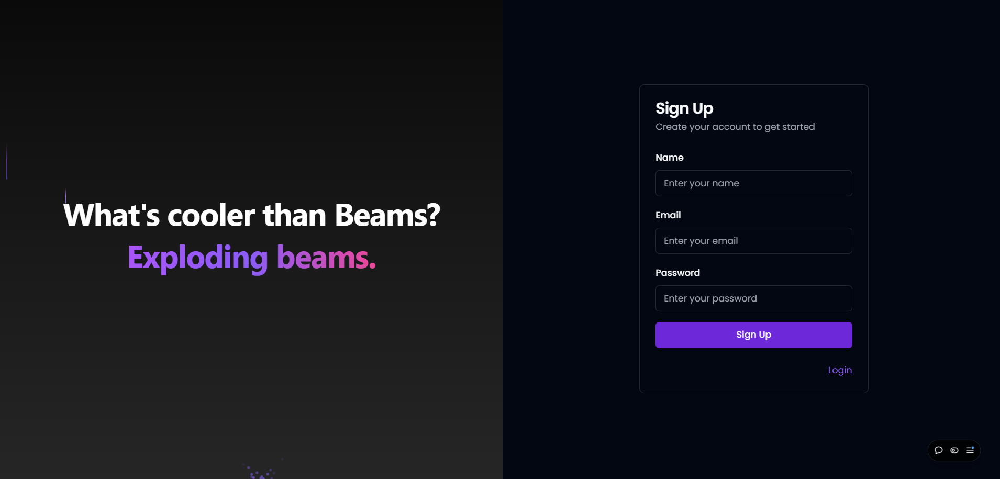
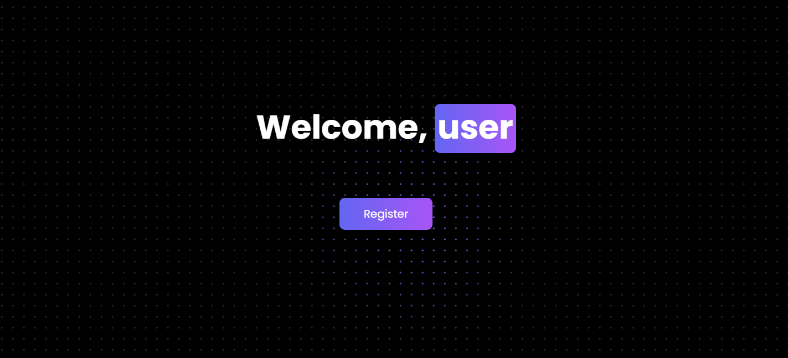
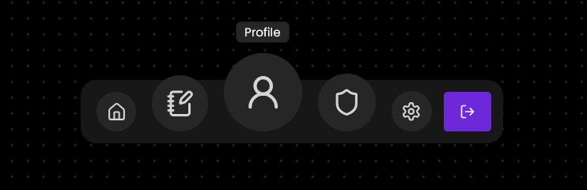
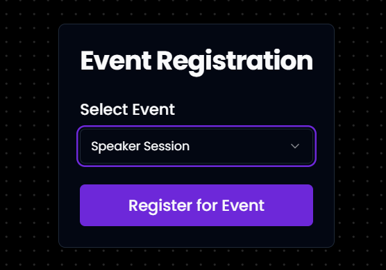
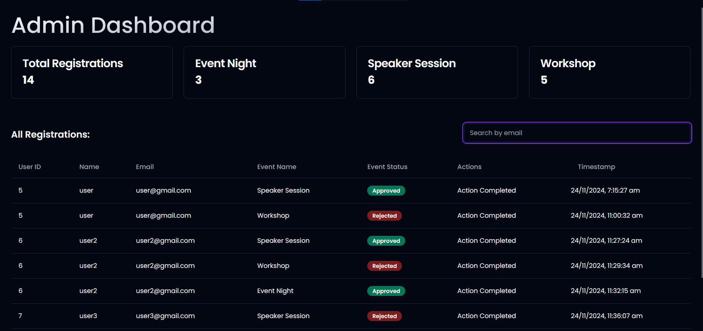
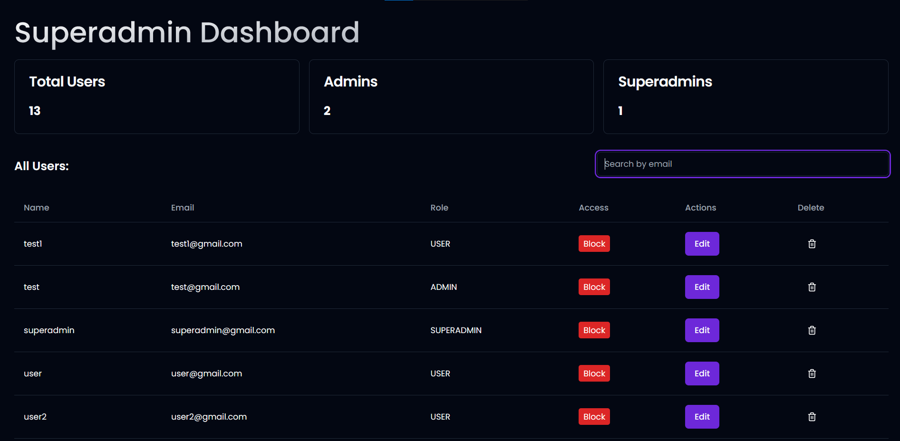

# Role-Based Access Control (RBAC)

## Project Overview

This project is a **Role-Based Access Control (RBAC) Dashboard** designed to manage user roles and permissions effectively. It features three types of users: **Superadmin**, **Admin**, and **User**, each with specific privileges:

- **Superadmin**:

  - Manage all users (edit roles, block/unblock, delete).
  - Promote/demote users to/from Admin.
  - Full control over the system.

- **Admin**:

  - Approve or reject user applications.
  - View and manage user statuses (but cannot manage other Admins or Superadmins).

- **User**:
  - Register and participate in events or activities.
  - Limited access to application features.

### Key Features

1. **User Management**:

   - View a list of all users with their details (name, email, role, status).
   - Promote/demote users between roles (e.g., User → Admin).
   - Block or unblock users.

2. **Access Control**:

   - Implement fine-grained role-based access control to restrict actions based on roles.

3. **Dynamic Role Updates**:

   - Update roles dynamically with instant UI feedback.

4. **Real-Time Notifications**:

   - Visual feedback for actions like role updates or user blocking.

5. **Scalable Architecture**:
   - Built with modern technologies including **Next.js**, **Prisma**, and **NeonDB** for seamless performance and scalability.

## Technologies Used

### Frontend

- **Next.js**:  
  Utilized for building a fast and efficient React-based frontend with server-side rendering (SSR) and static site generation (SSG).
- **Shadcn Components**:  
  For creating accessible, customizable, and reusable UI components that ensure consistency across the application.
- **Tailwind CSS**:  
  A utility-first CSS framework for styling, enabling rapid and responsive UI development.
- **Aceternity UI**:  
  Integrated to provide clean and modern and performant animations to bring the website to life.

### Backend

- **Prisma**:  
  ORM used to manage database schemas and streamline data access.
- **PostgreSQL (via NeonDB)**:  
  A robust relational database for storing and managing application data efficiently.

### Demostration

1. **Landing Page** : Animated with Framer Motion to produce an aurora effect. Click on the **Sign up now** button to create your account.

2. **Sign Up/ Login** : Fill out the credentials to create a new account or head to the login page.

3. **Profile Page**: Upon being authenticated, you will reach the profile page. Click on the **Register button** or find your way around with the **Floating Dock**

4. **Floating Dock** :

5. **Register Page**: Register for the event you want to attend from the dropdown and get notified instantly. Wait for the admin to accept or reject your application.

6. **Admin Dashboard**: Checkout all the applications, review them and then either accept or reject.Search for a particular applicaton.

**Note: Only an admin or a superadmin will be able to access this page. Find the admin credentials in the email**

7. **Superadmin Dashboard** : Get the list of all users registered in the platorm. Block them, edit their roles by promoting or demoting them. The superadmin has the absolute control over the website.

**Note: Only a superadmin will be able to access this page. Find the superadmin credentials in the email**
